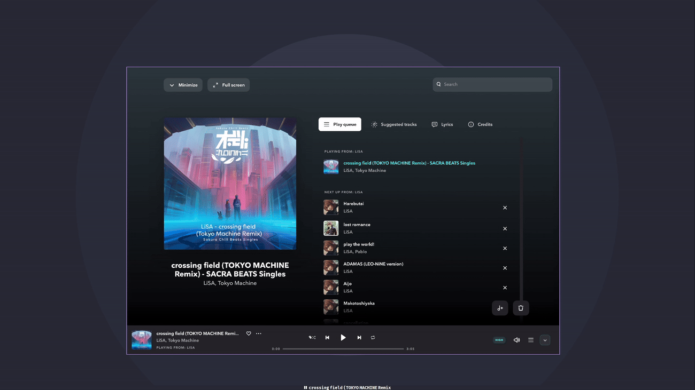

# polybar-tidal

This polybar module displays the current playing song in [Tidal] and allows to control the [tidal-hifi] application through mouse clicks.

 

## Dependencies

- [tidal-hifi] - electron app for <https://tidal.com> with Hi-Fi support
- [zscroll] - scroll text

Both available through `nix-env -iA nixpkgs.tidal-hifi nixpkgs.zscroll`

## Setup

```ini
[module/tidal]
type = custom/script
interval = 1
exec = ~/.config/polybar/scripts/tidal.sh scroll
tail = true
format = <label>
click-left = ~/.config/polybar/scripts/tidal.sh playpause
click-right = ~/.config/polybar/scripts/tidal.sh next
click-middle = ~/.config/polybar/scripts/tidal.sh previous
```

### Support for Xmonad

```haskell
keys =
  Map.fromList
    [ ((0, XF86.xF86XK_AudioPlay), spawn "bash $HOME/dotfiles/polybar/scripts/tidal.sh playpause")
    , ((0, XF86.xF86XK_AudioNext), spawn "bash $HOME/dotfiles/polybar/scripts/tidal.sh next")
    , ((0, XF86.xF86XK_AudioPrev), spawn "bash $HOME/dotfiles/polybar/scripts/tidal.sh previous")
    ...
    ]
```

## History

[](https://star-history.com/#monadplus/polybar-tidal&Date)

[Tidal]: https://tidal.com
[tidal-hifi]: https://github.com/Mastermindzh/tidal-hifi
[zscroll]: https://github.com/noctuid/zscroll
